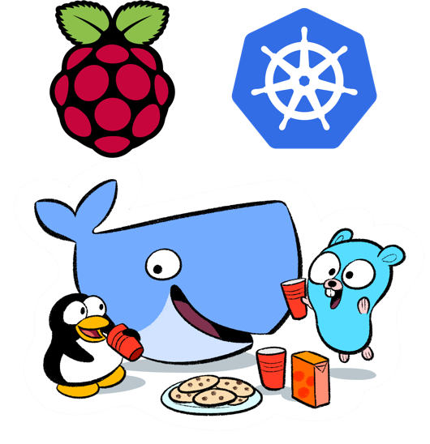

## Welcome to the Kubernetes on ARM project!

#### Kubernetes on a Raspberry Pi? Is that possible?

#### Yes, now it is (and has been since v1.0.1 with this project)
Imagine... Your own testbed for Kubernetes with cheap Raspberry Pis and friends. 



#### **Are you convinced too, like me, that cheap ARM boards and Kubernetes is a match made in heaven?**    
**Then, lets go!**

## Important information

This project was published in September 2015 as the first fully working way to easily set up Kubernetes on ARM devices.

You can read my story [here](https://www.cncf.io/blog/2016/11/29/diversity-scholarship-series-programming-journey-becoming-kubernetes-maintainer).

I worked on making it better non-stop until early 2016, when I started contributing the changes I've made back to Kubernetes core.
I strongly think that most of these features belong to the core, so everyone may take advantage of it, and so Kubernetes can be ported to even more platforms.

So I opened [kubernetes/kubernetes#17981](https://github.com/kubernetes/kubernetes/issues/17981) and started working on making Kubernetes cross-platform.
To date I've ported the Kubernetes core to ARM, ARM 64-bit and PowerPC 64-bit Little-endian. Already in `v1.2.0`, binaries were released for ARM, and I used the official binaries in `v0.7.0` in Kubernetes on ARM.

Since `v1.3.0` the `hyperkube` image has been built for both `arm` and `arm64`, which have made it possible to run Kubernetes officially the "kick the tires way".
So it has been possible to run `v1.3.x` Kubernetes on Raspberry Pi´s (or whatever arm or arm64 device that runs docker) with the [docker-multinode](https://github.com/kubernetes/kube-deploy/tree/master/docker-multinode) deployment!

I've written a proposal about how to make Kubernetes available for multiple platforms [here](https://github.com/kubernetes/community/blob/master/contributors/design-proposals/multi-platform.md)

Then I also ported `kubeadm` to `arm` and `arm64`, and `kubeadm` is so much better than the docker-multinode deployment method I used earlier (before the features that kubeadm takes advantage of existed).

So now the officially recommended and supported way of running Kubernetes on ARM is by following the [`kubeadm getting started guide`](kubernetes.io/docs/getting-started-guides/kubeadm/).
Since I've moved all the features this project had into the core, there's no big need for this project anymore.

### Get your ARM device up and running Kubernetes in less than ten minutes

#### Installation (both on master and node)

This assumes you are on HypriotOS, but you can do it on any Ubuntu/Debian as well (given you have docker installed):

```console
$ curl -s https://packages.cloud.google.com/apt/doc/apt-key.gpg | apt-key add -
$ echo "deb http://apt.kubernetes.io/ kubernetes-xenial main" > /etc/apt/sources.list.d/kubernetes.list
$ apt-get update && apt-get install -y kubeadm
```

#### Set up the master

Right now, the only pod network that works officially on ARM is flannel.
With flannel, you have to set `--pod-network-cidr` to `10.244.0.0/16` if you're using the official yaml file.

```console
$ kubeadm init --pod-network-cidr 10.244.0.0/16
$ curl -sSL https://rawgit.com/coreos/flannel/master/Documentation/kube-flannel.yml | sed "s/amd64/arm/g" | kubectl create -f -
```

If you're on `arm64`, replace `s/amd64/arm/g` with `s/amd64/arm64/g`.

#### Set up the node

Then it's as easy as this to join a node into your cluster.

```console
$ kubeadm join --token <token> <master-ip>
```

#### Deploying the dashboard

It's easy to depoly the dashboard as well.

```console
$ curl -sSL https://rawgit.com/kubernetes/dashboard/master/src/deploy/kubernetes-dashboard.yaml | sed "s/amd64/arm/g" | kubectl create -f -
```

You can access the dashboard on all nodes' port `30xyz` (randomly generated):
```console
$ kubectl -n kube-system get service kubernetes-dashboard -o template --template="{{ (index .spec.ports 0).nodePort }}"
```

#### Allowing normal workloads to be run on the master

If you want to run a one-node cluster or just want to run normal Pods on your master (however, you _shouldn't_ for security reasons), run this:

```console
$ kubectl taint nodes --all dedicated-
```

#### Deploying a demo application

For example, you can use the [NodePort feature of Services](http://kubernetes.io/docs/user-guide/services/) to expose your web application to the outside of your cluster.

```console
$ kubectl run my-nginx --image=luxas/nginx-test --replicas=3 --port=80
$ kubectl expose deployment my-nginx --port 80 --type NodePort
$ kubectl get service my-nginx -o template --template={{.spec.clusterIP}}
10.96.0.147
$ curl $(kubectl get service my-nginx -o template --template={{.spec.clusterIP}})
<p>WELCOME TO NGINX</p>
$ kubectl get service my-nginx -o template --template="{{ (index .spec.ports 0).nodePort }}"
30xyz
$ curl localhost:$(kubectl get service my-nginx -o template --template="{{ (index .spec.ports 0).nodePort }}")
<p>WELCOME TO NGINX</p>
```

#### Tear down

Very simple tear down process as well.
If it's a node, it will drain the node and remove it from the cluster.
If you're doing some maintainance on the node, you can pass `--remove-node=false`, and the node will be in `kubectl get nodes` but `NotReady` until you join again.

```console
$ kubeadm reset
```

#### Conclusion

I guess you noticed that these steps are identical to those who are described in the official kubeadm guide. Good!
Because that's my goal. Kubernetes should abstract away the CPU architecture as well.

See [my proposal for this feature](https://github.com/kubernetes/community/blob/master/contributors/design-proposals/multi-platform.md) and my [v1.6 work items](https://github.com/kubernetes/kubernetes/issues/38067) for more information, or reach out to me!

### Multi-platform clusters

If you want to mix all three platforms, run that command three times with the different architectures, and you'll have a multi-platform cluster!
Eventually, manifest lists will come to our rescue and make us stop doing `sed`s in the commands, but until then:

```console
$ kubectl create -f https://rawgit.com/coreos/flannel/master/Documentation/kube-flannel.yml
$ curl -sSL https://rawgit.com/coreos/flannel/master/Documentation/kube-flannel.yml | sed "s/amd64/arm/g" | kubectl create -f -
$ curl -sSL https://rawgit.com/coreos/flannel/master/Documentation/kube-flannel.yml | sed "s/amd64/arm64/g" | kubectl create -f -
```

#### My roadmap for the official multi-architecture features

 - Heapster
 - Ingress
 - Use manifest lists so we don't have to `sed` all the time
 - Make `hyperkube` working again by upgrading to go1.8

If you really want to see the deprecated flow with v0.8.0, look [here](OLDREADME.md)
